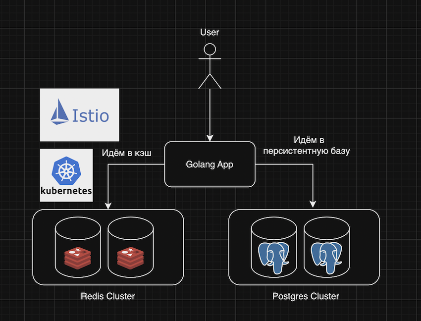
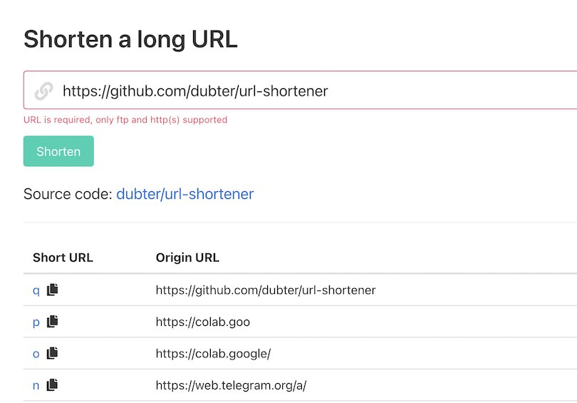

# URL Shortener
## Описание

Классический сервис для сокращения ссылок, написанный на Golang. 
Использовался Postgres в качестве основной персистентной базы данных и Redis в качестве кэша для уменьшения latency и нагрузки на Postgres.

## Архитектура



## API

```
GET http://localhost                       # Отдает домашнюю html страницу
GET http://localhost/favicon.ico           # Отдает иконку для сайта
GET http://localhost/<code>                # Проксирует короткий URL на заданный URL
POST http://localhost/api/urls             # Создаёт короткий URL
```

## Алгоритм хэширования

Среди всех возможных алгоритмов хэширования, используемых для генерации уникального кода для каждого URL-адреса, необходимо учитывать следующие проблемы:

1. **Длина кода**: Длина уникального кода имеет решающее значение, поскольку цель этого инструмента как раз и состоит в том, чтобы сгенерировать как можно меньший URL-адрес

2. **Коллизия кода**: Использование очень маленьких кодов (или маленьких словарей) может уменьшить количество возможных кодов и, таким образом, привести к коллизиям кода.

Учитывая вышеуказанные проблемы, было решено использовать сопоставление идентификатора со словарем.

Внутренний алгоритм, используемый при реализации решения, имеет длину 62 символа. Используя такой словарь и учитывая, что коды допустимы, если их длина не превышает 7 символов, это дает нам максимум 3,5 триллиона комбинаций.

Недостатком такого подхода является то, что коды являются последовательными, поскольку они генерируются на основе идентификаторов базы данных. Но поскольку URL-адреса являются общедоступными, это не проблема.


## Установка и запуск

Есть 3 варианта установки: `local, dev, prod`. Рассмотрим каждую из них.

1) `local`
Назначение: для дебага.

```
docker-compose up redis postgres nginx

# Ждём пока все запустится... 
# Отслеживать можно по логам

# Применяем миграции к Postgres:
url='host=localhost user=postgres dbname=postgres password=postgres sslmode=disable' make migrate-up

# Запускаем App. Можно в режиме дебага.
go run cmd/main.go -env config/.env-local

=> http://localhost
=> Profit!
```

2) `dev`
Назначение: Используется для тестирования перед отправкой на `prod`.
```
make compose

# Ждём пока все запустится... 
# Отслеживать можно по логам

# Применяем миграции к Postgres:
url='host=localhost user=postgres dbname=postgres password=postgres sslmode=disable' make migrate-up

=> http://localhost
=> Profit!
```

3) `prod`
Назначение: полноценный отказоустойчивый сервис в `k8s` c использованием Service Mesh `istio`. И соотвественно имеется полный мониторинг: метрики в собирает`prometheus`, готовые дашборды в `grafana`, трейсинг в `jaeger`. 

Также доступна удобная фишка `istio` - граф сервисов:


Чтобы установить в `k8s` с полным мониторингом необходимо:

```
# Создание образа App
docker build -t <image-name>:<tag> .              # Билдим образ для App
docker push <image-name>:<tag>                    # Отправляем в Registry
nano deploy/app.yaml                              # Меняем image на <image-name>:<tag>

# Выбор кластера
kubectl config get-contexts                       # Смотрим список кластеров в k8s
kubectl config use-context <context-name>         # Переключаемся на нужный нам кластер
 
# Istio
kubectl apply -f deploy/istio/1-istio-init.yaml   # Заливаем istio CRD
kubectl apply -f deploy/istio/2-istio.yaml        # Заливаем основные istio компоненты
kubectl apply -f deploy/istio/3-addons            # Заливаем дополнительные istio компоненты для мониторинга
kubectl apply -f deploy/istio/4-kiali-secret.yaml # Создаем секрет для kiali
kubectl apply -f deploy/istio/5-label-ns.yaml     # Ставим лейбл для неймспейса default!!!

# Ждём пока установится Istio...
# Отслеживать можно с помощью: kubectl get pods -n istio-system -w

# K8S
kubectl apply -f deploy/postgres.yaml             # Cтавим Postgres
kubectl apply -f deploy/redis.yaml                # Ставим Redis Cluster
kubectl apply -f deploy/app.yaml                  # Ставим Golang приложение с новым образом

# Ждём пока все установится... 
# Отслеживать можно с помощью: kubectl get pods -w

# Применяем миграции к Postgres:
kubectl port-forward svc/postgres-postgresql 5432:5432
psql -h localhost -p 5432 -U postgres postgres
# Вводим пароль, который лежит в секрете deploy/postrges.yaml, закодированный в base64
# И применяем миграции, которые лежат в папке migrations.

=> http://localhost
=> Profit!
```

